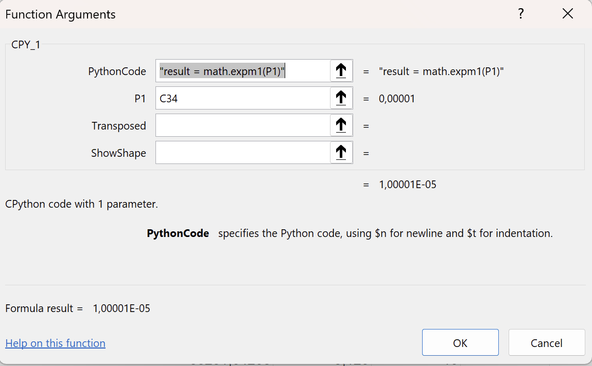
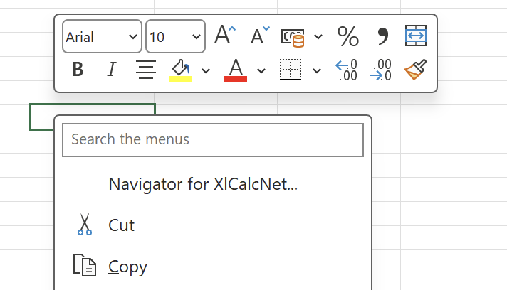
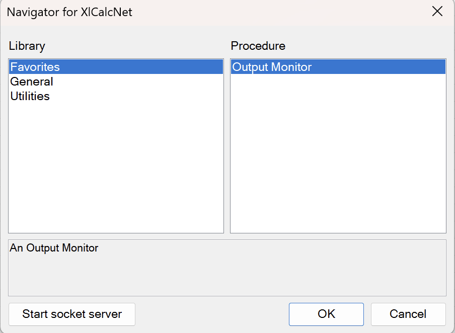

### XlCalcNet

XlCalcNet (a Microsoft E**X**ce**l** addin for **Calc**ulations in multiprecision, based on Python**Net**) focusses on numerical calculations in multiple precision and data visualisation.

The main goal of XlCalcNet is to enable the use of functions written in Python or C# within Microsoft Excel spreadsheet formulas. It is therefore assumed that Microsoft Excel (2010 or later, 64 bit) is installed on the users system, running under Windows (7.1 or later, 64 bit), with .NET Framework 4.8/4.8.1 installed. Detailed information regarding the installation and general usage of XlCalcNet can be found [here](https://duhadler.github.io/XlCalcNetDocsOnline/B01_GeneralUsage/C01_Setup.html).

The full manual is available online in HTML format: [XlCalcNet.html](https://duhadler.github.io/XlCalcNetDocsHTML/).

The manual can also be downloaded in PDF format from [XlCalcNet.pdf](https://github.com/duhadler/DocsXlCalcNet/raw/master/pdf/xlcalcnet.pdf).

Since the main goal is to give access to software written in Python (or, via [PythonNet](https://github.com/pythonnet/pythonnet), software written in C#) within Microsoft Excel spreadsheet formulas, a dedicated CPython installation is strongly recommend, to make it easier to configure the interaction with Microsoft Excel, without disturbing existing Python installations.

The interaction with Microsoft Excel is achieved by running a socket server written in Python, which is called from spreadsheet formulas using the functionality provided by [ExcelDna](https://github.com/Excel-DNA/ExcelDna).

The code which is necessary to make all of this work contains much more C\# and Pascal/C/C++ than Python, so the project is not really suitable as a project on PyPI, but is provided as a Github project only. Both the source code and precompiled binaries are included, since compiling all of the source code requires [MSYS2](https://www.msys2.org/), [Free Pascal](https://www.freepascal.org/) and [Visual Studio](https://visualstudio.microsoft.com/), which not all Excel users will want to install on their local system.

On the Python side XlCalcNet includes (a slightly patched version of) [Mpmath](https://github.com/mpmath/mpmath) 4.0 to provide a rich set of functions in arbitrary precision, using not only Mpmath's binary floating point and interval data types, but also Python's built-in Decimal and Fraction data types. If [gmpy2](https://github.com/gmpy2/gmpy2) is installed, its data types can be used in many cases instead of Mpmath's binary data types, being much faster. Likewise, if [python-flint](https://github.com/flintlib/python-flint) is installed, its data types can be used in many cases instead of Mpmath's interval data types, being much faster, and sometimes more accurate.

Also included in XlCalcNet is (a slightly patched version of) of [S3Dlib](https://github.com/fzaverl/s3dlib), a Python library for visualizing 3D surfaces and lines which is used in conjunction with the [Matplotlib](https://matplotlib.org/) library.

On the Pascal/C/C++ side, XlCalcNet uses [DAMath](https://github.com/duhadler/DAMath), [Boost Math](https://github.com/boostorg/math/), [Boost Multiprecision](https://github.com/boostorg/multiprecision), [Boost Odeint](https://www.boost.org/doc/libs/latest/libs/numeric/odeint/doc/html/index.html) and [Eigen](https://libeigen.gitlab.io/) to provide numerical functions in single, double, extended, quadruple and octuple precision, which are available to the user both from C# and Python.

The [XlCalcNet2](https://duhadler.github.io/XlCalcNet2/) library, which is licensed under the LGPL-3.0 and is therefore provided in a separate repository, is based on Boost Math, Boost Multiprecision, Boost Odeint, Eigen, [GMP](https://gmplib.org/), [MPFR](https://www.mpfr.org/), [MPC](https://www.multiprecision.org/mpc/) and [FLINT](https://flintlib.org/) and provides functions for the same data types as XlCalcNet and also in arbitrary precision, which are available to the user both from C# and Python.

XlCalcNet is intended to be used together with existing Python libraries like [NumPy](https://numpy.org/) (described in the manual [here](https://duhadler.github.io/XlCalcNetDocsOnline/B01_GeneralUsage/C08_Numpy.html)), [Matplotlib](https://matplotlib.org/) (described in the manual [here](https://duhadler.github.io/XlCalcNetDocsOnline/B01_GeneralUsage/C09_Matplotlib.html)), [Pandas](https://pandas.pydata.org/) (described in the manual [here](https://duhadler.github.io/XlCalcNetDocsOnline/B01_GeneralUsage/C10_Pandas.html)), [SciPy](https://scipy.org/) (described in the manual [here](https://duhadler.github.io/XlCalcNetDocsOnline/B01_GeneralUsage/C11_Scipy.html)). 

### Use with Microsoft Excel

This shows Excel's function dialog with a python script example

  

XlCalcNet can also be used for procedures. To access the relevant dialog, right-click anywhere on the spreadsheet. The following context menu will appear:

  

Click on Navigator for XlCalcNet. The following dialog box will appear:

  

### SourceOfBasicLibraries

The SourceOfBasicLibraries repository provides copies of the source code of the underlying numerical libraries, which are required to build the [XlCalcNet](https://duhadler.github.io/XlCalcNet/) library. These copies also include small patches, as required. They are provided to make it easier to reproduce the compilation results, as distributed as part of the [XlCalcNet](https://duhadler.github.io/XlCalcNet/) repository.

The source code of the following libraries is included:

[Eigen](https://libeigen.gitlab.io/), (version 5.0.1).

[Boost](https://www.boost.org/), (version 1.90.0)

[Amath/DAMath](https://github.com/chadilukito/www.wolfgang-ehrhardt.de/tree/master) (version 2.27).

### SourceOfBasicLibraries2

The SourceOfBasicLibraries2 repository provides copies of the source code of the underlying numerical libraries, which are required (in addition to Eigen and Boost, see [SourceOfBasicLibraries](https://github.com/duhadler/SourceOfBasicLibraries)) to build the [XlCalcNet2](https://duhadler.github.io/XlCalcNet2/) library.. These copies also include small patches and .sh files, as required. They are provided to make it easier to reproduce the compilation results, as distributed as part of the [XlCalcNet2](https://duhadler.github.io/XlCalcNet2/) repository.

The source code of the following libraries is included:

[GMP](https://gmplib.org/) (version 6.3.0), 

[MPFR](https://www.mpfr.org/) (version 4.2.2), 

[MPC](https://www.multiprecision.org/mpc/) (version 1.3.1), 

[FLINT](https://flintlib.org/) (version 3.4.0).

